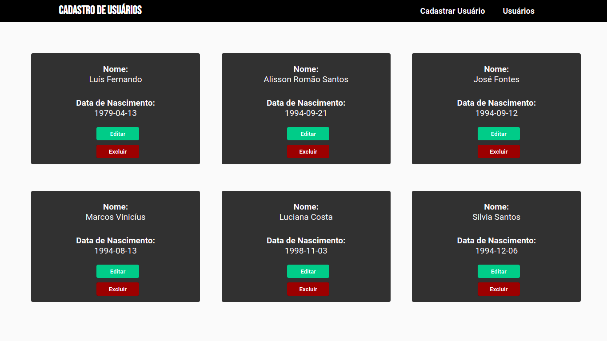

<h1 align="center">Projeto Sign Up</h1>



## Tecnologias
   - React
   - Sass

## Como executar
##### Clone o repositório
```bash
git clone https://github.com/alissonrsantos/sign-up-web.git
```
##### Abra a pasta
```bash
cd sign-up-web
```

##### Abra no Vscode
```bash
code .
```

##### Instale as dependências
```bash
npm install
```
ou

```bash
yarn
```

##### Abra no navegador
```bash
npm start
```
ou

```bash
yarn start
```

O projeto irá rodar em localhost:3000. Depois é só iniciar o servidor para que as informações do usuário sejam carregadas no navegador.

### Funcionalidades
  - [ x ] Listar usuários
  - [ x ] Criar usuários
  - [ x ] Atualizar dados dos Usuários
  - [ x ] Excluir usuários

### &copy; Licença
MIT

Feito por Alisson Romão Santos <br />
[LINKEDIN](https://linkedin.com/in/alissonrsantos)
